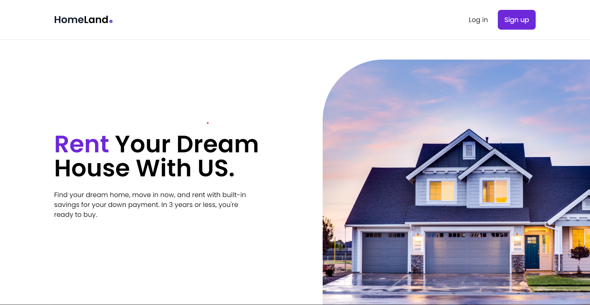
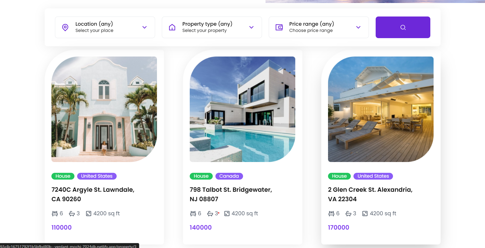
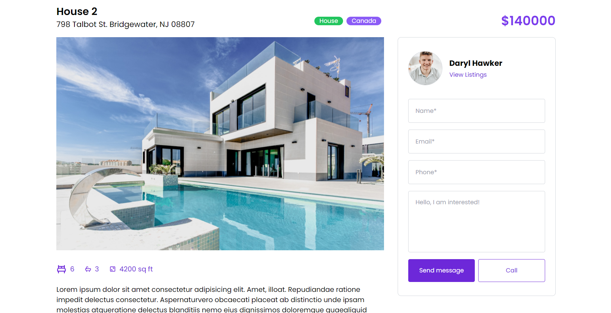
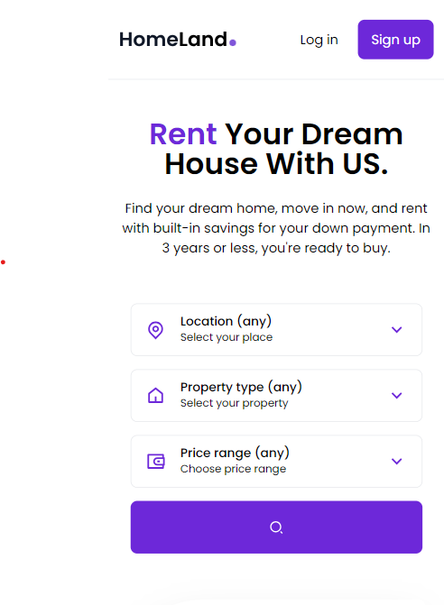

# Real Estate Application

This frontend-only project is a real estate application built with React and Tailwind CSS. It allows users to browse available properties, view listings, and apply filters based on country, property type (house, apartment, etc.), and price range. The project utilizes advanced logic to dynamically handle filters and display relevant property cards.

## Live Demo

You can access the live demo of the real estate application [here](https://65c8c16751792f1b5bfbd80b--verdant-mochi-7024db.netlify.app/).

## Screenshots





## Features

- Browse through available properties
- View property listings
- Apply filters based on country, property type, and price range
- Advanced logic to dynamically handle and display filtered property cards
- Usage of React's Context API to prevent prop drilling
- Responsive design for all screens

## Technologies Used

- **React.js:** A JavaScript library for building user interfaces.
- **Tailwind CSS:** A utility-first CSS framework for building modern and responsive designs.
- **React Router:** Declarative routing for React.js.
- **React Context API:** State management for React applications.

## Installation

To run this project locally, follow these steps:

1. Clone the repository:

   ```bash
   git clone https://github.com/sargunkohli152/Homeland-RealEstate.git
   ```

2. Navigate into the project directory:

   ```bash
   cd Homeland-RealEstate
   ```

3. Install dependencies

   ```bash
   npm install
   ```

4. Start the development server

   ```bash
   npm run start
   ```

5. Open your browser and navigate to http://localhost:3000 to view the website.


## Usage
Explore the real estate application, browse properties, view listings, and try out different filters to see the dynamic display of relevant property cards.


## Contributing
Contributions are welcome! If you'd like to contribute to this project, please follow the Contributing Guidelines.


## License
This project is licensed under the
